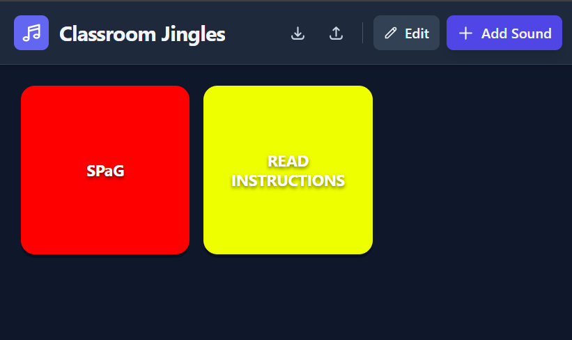

# simpleSoundboard

A simple, fully local, ad-free soundboard I vibe-coded to play silly jingles I generated using Google Gemini. It stores all uploaded sounds locally in your browser, so you can create and manage your soundboard without any external dependencies or privacy concerns. You can also download your created soundboards as JSON files for backup or sharing, and easily import them back into the app whenever you want.

## Features

 - Upload audio files of your choice.
 - Assign a colour and text to your buttons.
 - Play sounds with a single click.
 - All data is stored locally in your browser, ensuring privacy and quick access.
 - No ads, no tracking, nothing sinister whatsoever.
 - Download created soundboards as JSON files for backup or sharing.
 - Uploaded soundboards can be imported back into the app, allowing you to easily restore or share your custom soundboard setups.

## How to access

### Open the app

[Open the app](https://h-arnold.github.io/simpleSoundboard/)

### Download the html file

Download the `index.html` file from the repository and open it in your web browser. This will allow you to use the soundboard locally on your device.